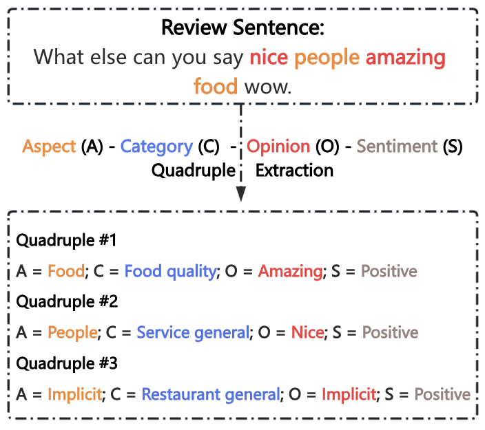
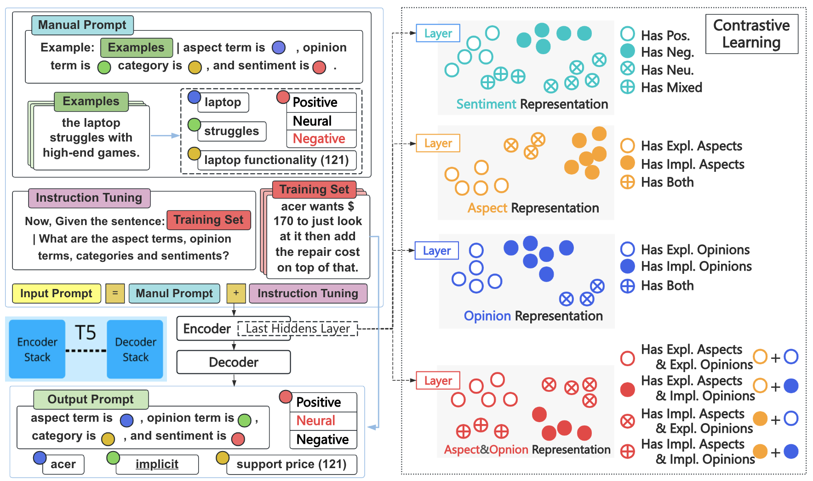

<h1 align="center">
An Instruction Tuning-Based Contrastive Learning Framework for Aspect Sentiment Quad Prediction with Implicit Aspects and Opinions</h1>

<div align="center">


[]([https://opensource.org/licenses/MIT](https://img.shields.io/github/license/sydmou/ASQP-ITSCL))


Repo for EMNLP 2024 Findings Paper [ITSCL: An Instruction Tuning-Based Contrastive Learning Framework for Aspect Sentiment Quad Prediction with Implicit Aspects and Opinions](https://aclanthology.org/2024.findings-emnlp.453/).

## ✨ Introduction 

ITSCL is an instruction tuning-based contrastive learning method for ASQP Prediction:

- ITSCL  **combination of elements**:


<p align="center">
    
</p>


## ✨ Methods 

<p align="center">
    
</p>

## Results
The quadruple extraction performance of five different systems (including baseline and +UAUL) on the four datasets:

<p align="center">
  
</p>

<p align="center">
  
</p>

We further investigate the ability of UAUL under low resource scenario:

<p align="center">
  
</p>


## Environment
    Python==3.8
    torch==1.11.0
    transformers==4.14.1
    pytorch_lightning==0.8.1
    numpy==1.21.2

## ☕️ Citation

If you find this repository helpful, please consider citing our paper:

```
@inproceedings{zhang-etal-2024-instruction,
    title = "An Instruction Tuning-Based Contrastive Learning Framework for Aspect Sentiment Quad Prediction with Implicit Aspects and Opinions",
    author = "Zhang, Hao  and
      Cheah, Yu-N  and
      He, Congqing  and
      Yi, Feifan",
    editor = "Al-Onaizan, Yaser  and
      Bansal, Mohit  and
      Chen, Yun-Nung",
    booktitle = "Findings of the Association for Computational Linguistics: EMNLP 2024",
    month = nov,
    year = "2024",
    address = "Miami, Florida, USA",
    publisher = "Association for Computational Linguistics",
    url = "https://aclanthology.org/2024.findings-emnlp.453",
    pages = "7698--7714",
}
```
